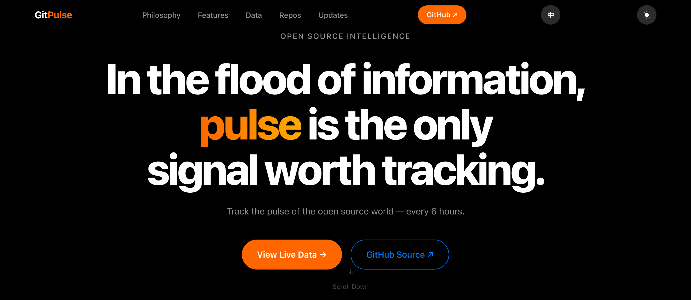
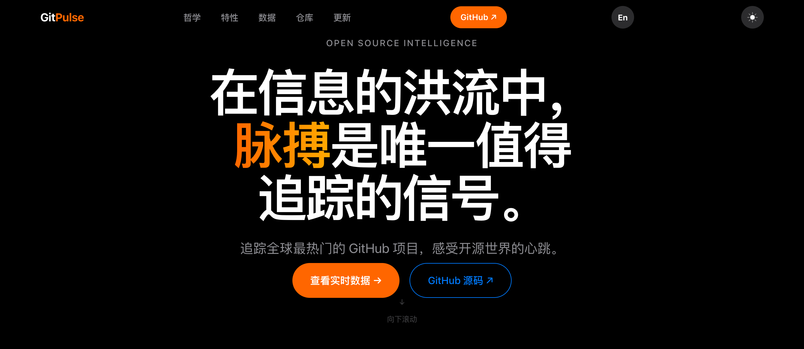
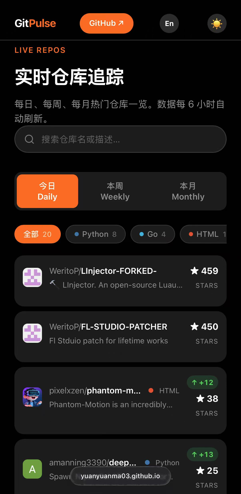
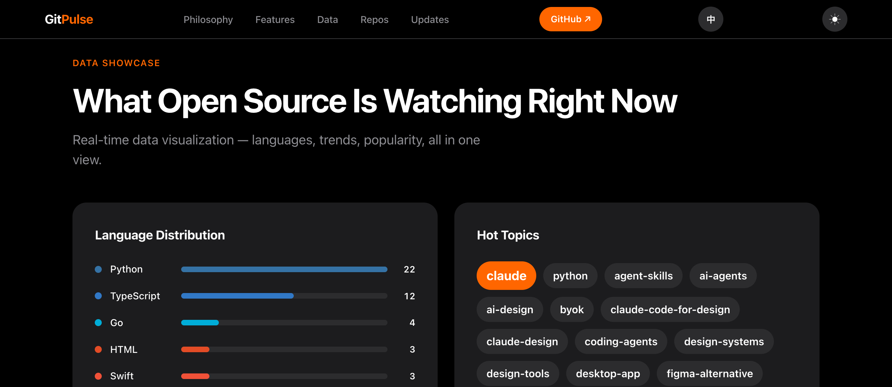
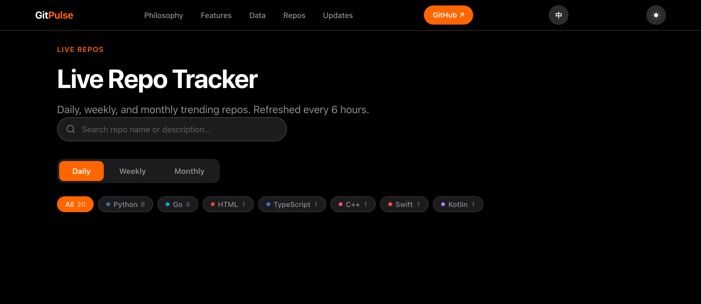

<div align="center">

# GitPulse

**开源脉搏，实时跳动。** / *Track the pulse of the open source world.*

🌐 中文 · English &nbsp;|&nbsp; 每 6 小时自动更新

[🌐 Live Demo (GitHub Pages)](https://yuanyuanma03.github.io/GitPulse/) · [⚡ Live Demo (Vercel)](https://gitpulse-orpin.vercel.app) · [📦 Source](https://github.com/YuanyuanMa03/GitPulse)

---

### ⚡ 30 秒一键部署你自己的 GitPulse

[](https://vercel.com/new/clone?repository-url=https://github.com/YuanyuanMa03/GitPulse) &nbsp; [](https://app.netlify.com/start/deploy?repository=https://github.com/YuanyuanMa03/GitPulse)

点击按钮 → Fork & 部署 → 你的实例上线。就这么简单。

> 💡 部署后记得去仓库的 **Settings → Actions → General** 开启 workflow 权限，数据才会自动更新。

---

</div>

<p align="center">
  <em>In the flood of information, <strong>pulse</strong> is the only signal worth tracking.</em>
  <br>在信息的洪流中，<strong>脉搏</strong>是唯一值得追踪的信号。
</p>

<p align="center">

<br><sub>🌐 English — Dark Mode</sub>
</p>

<p align="center">

<br><sub>🇨🇳 中文 — Dark Mode</sub>
</p>

<p align="center">

<br><sub>📱 移动端效果 / Mobile View</sub>
</p>

## 🌐 中英双语 / Bilingual

GitPulse 支持**中文 / English** 完整双语切换。零依赖纯 vanilla JS 实现：

- **一键切换** — 导航栏右侧的 `中`/`En` 按钮，带淡入淡出过渡动画
- **自动检测** — 根据浏览器语言自动选择，偏好持久化到 `localStorage`
- **全站覆盖** — 静态文本、JS 动态生成内容（仓库卡片、筛选片、详情面板）全部同步切换
- **设计签名** — 哲学卡片标题中英双语常驻，section eyebrows（Apple 风格装饰）保持英文

```
data-i18n 属性 → textContent
data-i18n-html → innerHTML（保留 <br> <span>）
data-i18n-placeholder → input placeholder
CSS [lang] 规则 → 双元素对（计数器标签、Hero 副标题）
```

## 哲学

> 在信息的洪流中，**脉搏**是唯一值得追踪的信号。

开源世界的价值不在于"有多少仓库"，而在于**此刻什么正在被创造、被关注、被推动**。

GitPulse 不是另一个 GitHub 排行榜。它试图回答一个更本质的问题：**此刻，开源社区的注意力在哪里？**

我们相信三件事：

- **数据即脉搏** — 每 6 小时捕获一次，如同心电图般记录开源世界的每一次心跳
- **趋势即方向** — 从 topics 关键词云中，你能看到技术思潮的涌动
- **极简即尊重** — Apple 级的设计语言，因为好的数据值得好的容器

## 实时数据

语言分布、热门关键词、Stars 排行、ECG 脉搏信号 — 所有数据从 `data.json` 动态加载，纯 CSS/Canvas 可视化。

<p align="center">

</p>

## 仓库追踪

每日、每周、每月热门仓库。支持**搜索**、**语言筛选**、**内联详情面板**（点击展开）、**Stars 增量追踪**（delta badges）。按语言过滤，零延迟本地搜索。

<p align="center">

</p>

## 特性

- 🌐 **中英双语切换** — 全站中文/English 一键切换，浏览器语言自动检测
- 🖤 **明暗双主题** — 深色/浅色一键切换，偏好自动保存
- 🔍 **实时搜索** — 仓库名和描述即时过滤，200ms 防抖
- 🏷️ **语言筛选** — 颜色标识的可滚动筛选片，按语言精确定位
- 📋 **内联详情面板** — 点击仓库卡片展开完整信息（创建日期、Last Push、Forks、Issues）
- 📈 **Stars 增量追踪** — 绿色 delta 徽章显示自上次更新后的 stars 增长
- 📊 **纯 HTML/CSS 图表** — 语言分布条、Stars 排行、关键词云，零依赖
- 💓 **ECG 脉搏动画** — Canvas 绘制的心电图实时动画
- ✨ **滚动渐现动画** — IntersectionObserver 驱动，每个元素优雅浮入
- 🔢 **数字跳动计数器** — 关键指标从 0 动态增长
- 📱 **全响应式** — 桌面、平板、手机完美适配
- 🔄 **每 6 小时自动更新** — GitHub Actions 自动抓取，永不过时
- ⚡ **零框架零依赖** — 纯 HTML / CSS / Vanilla JS，无构建步骤

## 技术栈

| 层 | 技术 |
|---|---|
| 前端 | 纯 HTML / CSS / Vanilla JS（零框架） |
| i18n | `data-i18n` 属性 + T 字典 + CSS `[lang]` 规则 |
| 图表 | 纯 CSS 条形图 + 标签云 + Canvas ECG |
| 数据 | GitHub Search API → `data.json`（含 delta 计算 + README 兜底提取） |
| 部署 | GitHub Pages + Vercel + Netlify |
| 自动化 | GitHub Actions（每天 4 次） |

## 🔄 Auto Update

数据通过 GitHub Actions 自动更新，每天 4 次（UTC 0:00 / 6:00 / 12:00 / 18:00）：

```yaml
schedule:
  - cron: '0 0,6,12,18 * * *'
```

也支持手动触发：`Actions → Update Trending Data → Run workflow`

## 本地开发

```bash
git clone https://github.com/YuanyuanMa03/GitPulse.git
cd GitPulse
python3 fetch_trending.py          # 拉取数据
python3 -m http.server 8080        # 启动服务
# 浏览器打开 http://localhost:8080
```

## 项目结构

```
├── index.html              # 单文件 HTML，全部结构 + data-i18n 属性
├── style.css               # Apple 暗色/亮色主题 + 语言切换样式
├── main.js                 # 交互逻辑（i18n / 搜索 / 筛选 / 详情面板 / 主题切换）
├── data.json               # GitHub trending 数据（自动生成）
├── fetch_trending.py       # 数据抓取 + delta 计算 + README 兜底
├── update.sh               # 更新脚本
├── .github/workflows/
│   └── update.yml          # 自动更新 workflow
└── screenshots/
    ├── hero-en-dark.png     # 英文深色模式 Hero
    ├── data-en.png          # 英文数据可视化
    ├── repo-en.png          # 英文仓库追踪
    ├── hero-dark.png        # 中文深色模式 Hero（旧版参考）
    ├── hero-light.png       # 中文浅色模式 Hero
    ├── data-showcase.png    # 中文数据可视化
    └── repo-explorer.png    # 中文仓库追踪
```

---

<div align="center">

**Built with ♥ by [YuanyuanMa03](https://github.com/YuanyuanMa03)**

*追踪脉搏，而非噪音。* / *Track the pulse, not the noise.*

</div>
