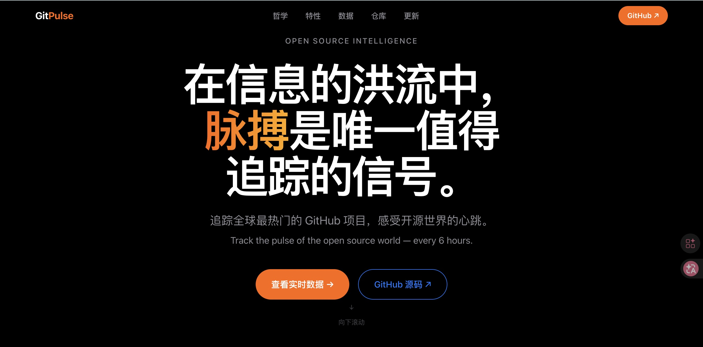
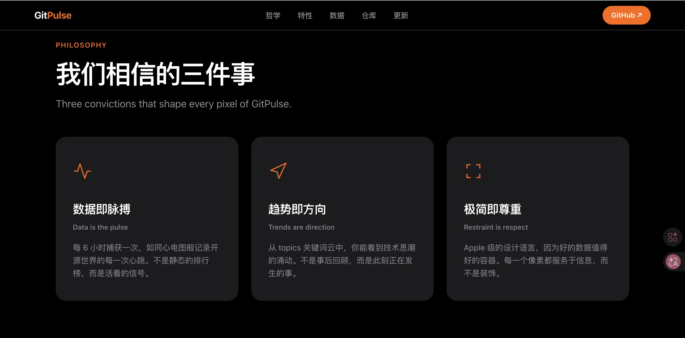
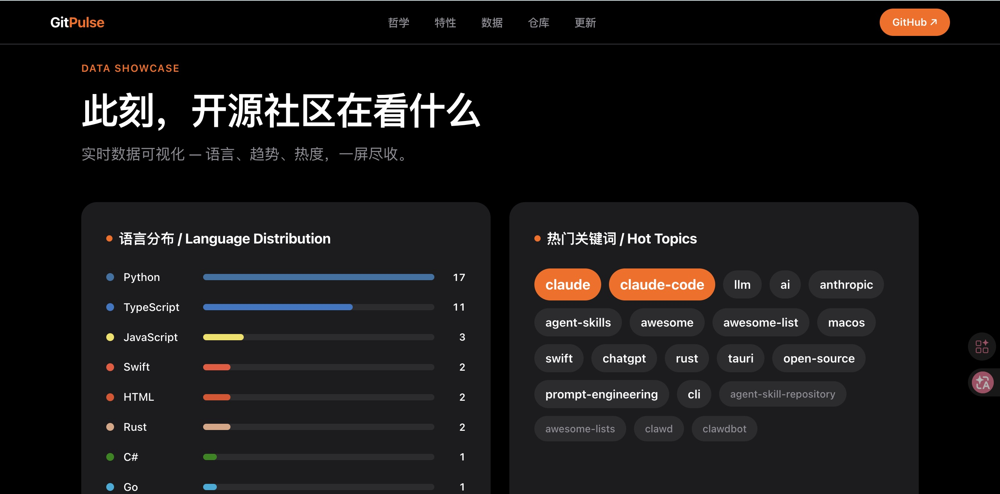
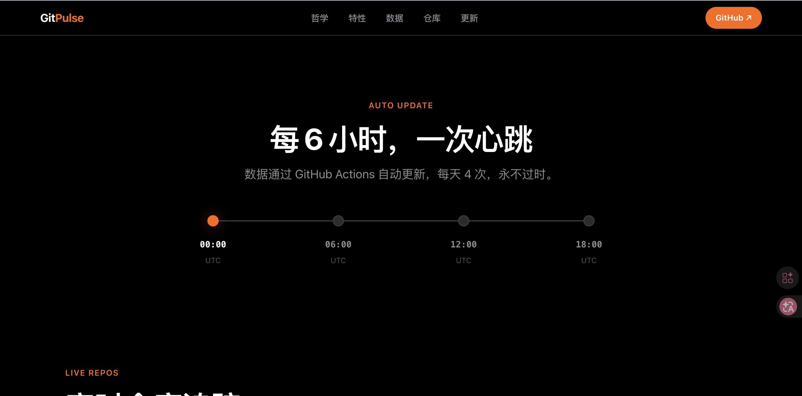
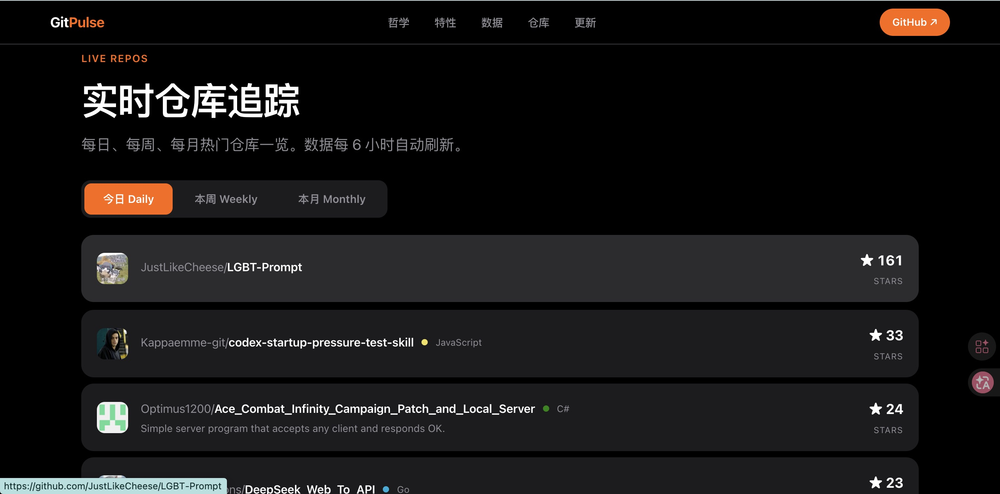

<div align="center">

# GitPulse

**开源脉搏，实时跳动。**

*Track the pulse of the open source world — every 6 hours.*

[🌐 Live Demo](https://yuanyuanma03.github.io/GitPulse/) · [📦 Source](https://github.com/YuanyuanMa03/GitPulse)

</div>

---

<p align="center">

</p>

## 哲学

> 在信息的洪流中，**脉搏**是唯一值得追踪的信号。

开源世界的价值不在于"有多少仓库"，而在于**此刻什么正在被创造、被关注、被推动**。

GitPulse 不是另一个 GitHub 排行榜。它试图回答一个更本质的问题：**此刻，开源社区的注意力在哪里？**

<p align="center">

</p>

我们相信三件事：

- **数据即脉搏** — 每 6 小时捕获一次，如同心电图般记录开源世界的每一次心跳
- **趋势即方向** — 从 topics 关键词云中，你能看到技术思潮的涌动
- **极简即尊重** — Apple 级的设计语言，因为好的数据值得好的容器

## 实时数据

语言分布、热门关键词、Stars 排行 — 所有数据从 `data.json` 动态加载，每 6 小时自动刷新。

<p align="center">

</p>

## 仓库追踪

每日、每周、每月热门仓库一览。点击任意仓库直接跳转 GitHub。

<p align="center">

</p>

<p align="center">

</p>

## 特性

- 🖤 **Apple-grade 暗色设计** — 受 Apple 产品页启发，极致克制的视觉语言
- 📊 **纯 HTML/CSS 图表** — 语言分布条、Stars 排行、关键词云，零依赖
- ✨ **滚动渐现动画** — IntersectionObserver 驱动，每个元素优雅浮入
- 🔢 **数字跳动计数器** — 关键指标从 0 动态增长
- 📱 **全响应式** — 桌面、平板、手机完美适配
- 🔄 **每 6 小时自动更新** — GitHub Actions 自动抓取，数据永不过时
- 🏷️ **Topics 关键词云** — 从仓库标签中提取技术趋势
- 📋 **Daily / Weekly / Monthly** — 三维度实时仓库列表
- 💓 **ECG 脉搏动画** — Canvas 绘制的心电图效果
- ⚡ **零框架零依赖** — 纯 HTML / CSS / Vanilla JS

## 技术栈

| 层 | 技术 |
|---|---|
| 前端 | 纯 HTML / CSS / Vanilla JS（零框架） |
| 图表 | 纯 CSS 条形图 + 标签云 + Canvas ECG |
| 数据 | GitHub Search API → `data.json` |
| 部署 | GitHub Pages（Legacy） |
| 自动化 | GitHub Actions（每天 4 次） |

## 🔄 Auto Update

数据通过 GitHub Actions 自动更新，每天 4 次（UTC 0:00 / 6:00 / 12:00 / 18:00）：

```yaml
schedule:
  - cron: '0 0,6,12,18 * * *'
```

也支持手动触发：`Actions → Update Trending Data → Run workflow`

## 本地开发

```bash
git clone https://github.com/YuanyuanMa03/GitPulse.git
cd GitPulse
python3 fetch_trending.py
python3 -m http.server 8080
# 浏览器打开 http://localhost:8080
```

## 项目结构

```
├── index.html          # 单文件 SPA，所有样式和逻辑
├── data.json           # GitHub trending 数据（自动生成）
├── fetch_trending.py   # 数据抓取脚本
├── .github/workflows/
│   └── update.yml      # 自动更新 workflow
└── docs/
    └── *.jpg            # README 截图
```

---

<div align="center">

**Built with ♥ by [YuanyuanMa03](https://github.com/YuanyuanMa03)**

*追踪脉搏，而非噪音。*

</div>
