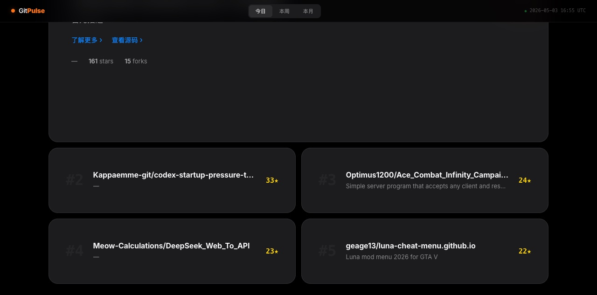
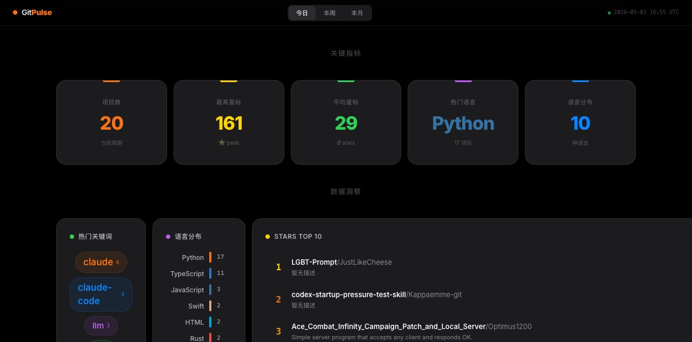

<div align="center">

# GitPulse

**开源脉搏，实时跳动。**

*A real-time pulse of the open source world.*

[🌐 Live Demo](https://yuanyuanma03.github.io/GitPulse/) · [⚙️ Auto Update](#-auto-update)

</div>

---

<p align="center">

</p>

<p align="center">

</p>

<p align="center">

</p>

---

## 哲学

> 在信息的洪流中，**脉搏**是唯一值得追踪的信号。

开源世界的价值不在于"有多少仓库"，而在于**此刻什么正在被创造、被关注、被推动**。

GitPulse 不是另一个 GitHub 排行榜。它试图回答一个更本质的问题：

> **此刻，开源社区的注意力在哪里？**

我们相信：
- **数据即脉搏** — 每 6 小时捕获一次，如同心电图般记录开源世界的每一次心跳
- **趋势即方向** — 从 `topics` 关键词云中，你能看到技术思潮的涌动
- **极简即尊重** — Apple 级的设计语言，因为好的数据值得好的容器

## 特性

- 🖤 **Apple-grade 暗色设计** — 受 Apple 产品页启发，极致克制的视觉语言
- 📊 **纯 HTML/CSS 图表** — 零依赖，语言分布条、Stars 排行、关键词云，全端自适应
- ✨ **滚动渐现动画** — IntersectionObserver 驱动，每个元素优雅浮入
- 🔢 **数字跳动计数器** — 关键指标从 0 动态增长，数据有生命力
- 📱 **全响应式** — 桌面、平板、手机，完美适配
- 🔄 **每 6 小时自动更新** — GitHub Actions 自动抓取，数据永不过时
- 🏷️ **Topics 关键词云** — 从仓库标签中提取技术趋势，一目了然

## 技术栈

| 层 | 技术 |
|---|---|
| 前端 | 纯 HTML / CSS / Vanilla JS（零框架） |
| 图表 | 纯 CSS 条形图 + 标签云（零依赖） |
| 数据 | GitHub Search API → `data.json` |
| 部署 | GitHub Pages |
| 自动化 | GitHub Actions（每天 4 次） |

## 🔄 Auto Update

数据通过 GitHub Actions 自动更新，每天 4 次（UTC 0:00 / 6:00 / 12:00 / 18:00）：

```yaml
# .github/workflows/update.yml
schedule:
  - cron: '0 0,6,12,18 * * *'
```

也支持手动触发：`Actions → Update Trending Data → Run workflow`

> `GITHUB_TOKEN` 由 GitHub Actions 自动生成，每次运行后失效，非个人 Token，无安全风险。

## 本地开发

```bash
# 拉取最新数据
python3 fetch_trending.py

# 启动本地服务器
python3 -m http.server 8080

# 浏览器打开
open http://localhost:8080
```

## 项目结构

```
├── index.html          # 单文件 SPA，包含所有样式和逻辑
├── data.json           # GitHub trending 数据（自动生成）
├── fetch_trending.py   # 数据抓取脚本
├── .github/workflows/
│   └── update.yml      # 自动更新 workflow
└── docs/
    └── screenshot-*.jpg # README 截图
```

---

<div align="center">

**Built with ♥ by [YuanyuanMa03](https://github.com/YuanyuanMa03)**

*追踪脉搏，而非噪音。*

</div>
